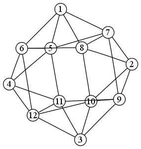

# The problem

I want to have a format that I can convert to `pdf, html`, and maybe
`odt`. The formats I know well are

-   LaTeX

-   org

One thing I like about org is that it is rather simple, and the
documents look clean. I do not like that it seems to change
constantly and that it is not as universally known as LaTeX.

I want to use:

-   links, say [Google](http://google.com).

-   images, say
    
    
    
    Apparently one has to have a blank line so that the image looks
    OK. Also, with a caption, the image is centered both in LaTeX and
    HTML export.

-   code, say
    
        def test(a):
            """This is just a test
        
            Arguments:
            - `a`: test argument
            """

-   math symbols, say \(a^{2}+b^{2}=c^{2}\)

-   displayed equations, like:
    
    \begin{equation}
    a^{2}+b^{2}=c^{2}
    \end{equation}

-   theorems, definitions, etc.

-   references, to a bibliographic resource or to another theorem
    previously stated.

# Resources

## In blogs

-   [Makefiles for tikz sagemath and teaching notes written in markdown](http://drvinceknight.blogspot.mx/2013/04/makefiles-for-tikz-sagemath-and.html)
    Dr. Knight shows a workflow having markdown as source format. Also
    uses `sage` for producing images.

-   [org-exp-bibtex | Sail Home](http://bowenli37.wordpress.com/tag/org-exp-bibtex/) A post describing the use of
    `org-exp-bibtex`, which has been removed from org-mode, as seen in:
    [org-exp-bibtex missing in git?](http://thread.gmane.org/gmane.emacs.orgmode/67488/focus=67839) From that thread, this post by Eric
    Fraga seems to be useful: [org-exp-bibtex missing in git?](http://thread.gmane.org/gmane.emacs.orgmode/67488/focus=67839) as this by
    Rasmus: [org-exp-bibtex missing in git?](http://thread.gmane.org/gmane.emacs.orgmode/67488/focus=67839) BTW, this might be the
    origin of all the code using bibtex in org: [dealing with a bibliography](http://article.gmane.org/gmane.emacs.orgmode/2406/match=bibliography)

-   Eric's suggestion apparently uses `ebib`: [joostkremers/ebib · GitHub](https://github.com/joostkremers/ebib)

-   About pandoc: [Pandoc Converts All Your (Text) Documents -
    ProfHacker](http://chronicle.com/blogs/profhacker/pandoc-converts-all-your-text-documents) and [Make Your Own E-Books with Pandoc - ProfHacker](http://chronicle.com/blogs/profhacker/make-your-own-e-books-with-pandoc)

## github

-   [Which is a good format to make documents?](http://rvf0068.github.io/org-document-test/) The github page of this document&#x2026;
